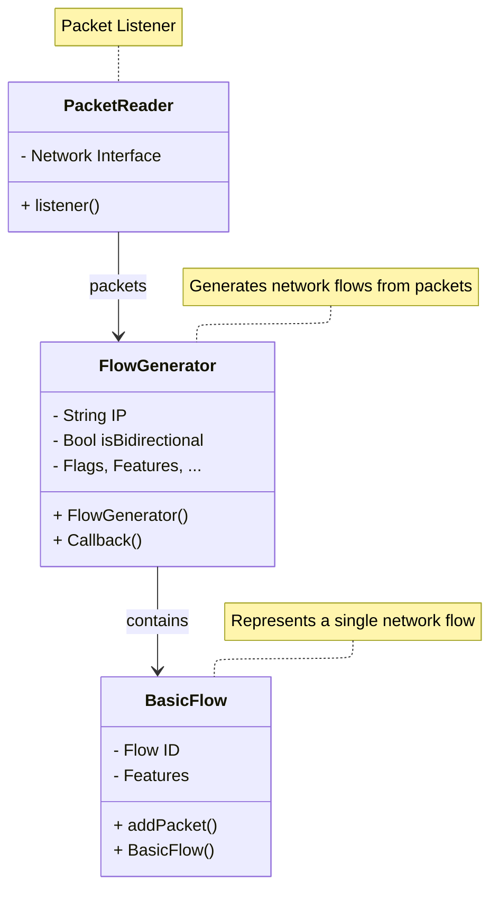

```mermaid
---
config:
  layout: elk
---
classDiagram
direction TB
    class FlowGenerator {
	    - String IP
	    - Bool isBidirectional
	    - Flags, Features, ...
	    + FlowGenerator()
	    + Callback()
    }

    class BasicFlow {
        - Flow ID
	    - Features
	    + addPacket()
	    + BasicFlow()
    }

    class PacketReader {
	    - Network Interface
	    + listener()
    }

	note for PacketReader "Packet Listener"
	note for FlowGenerator "Generates network flows from packets"
	note for BasicFlow "Represents a single network flow"

    PacketReader --> FlowGenerator : packets
    FlowGenerator --> BasicFlow : contains
```